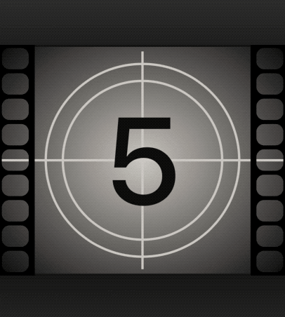

# Countdown film clutter in SwiftUI

After first successful 😎 approach ([FlipClock](https://github.com/elpassion/FlipClock-SwiftUI)) to animations in SwiftUI, I've decided to create the next sample project. Looking for inspiration in the endless Internet, I've found old fashioned countdown film clutter. I realized that it could be challenging to do sth similar in the new Apple UI framework - SwiftUI. Please stop for a moment and take a look at the results of my work.

### [Implemetation](https://github.com/elpassion/CountdownFilmClutter-SwiftUI)

## License

Copyright © 2019 [EL Passion](https://www.elpassion.com)

License: [GNU GPLv3](../../LICENSE)
