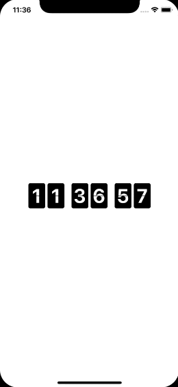

# Flip clock implementation in SwiftUI

SwiftUI is a new framework designed and released by Apple in 2019. It completely changes the approach to building UI on Apple devices. Compared to predecessors (UIKit, WatchKit, AppKit), you can write code only once and use it on every Apple platform. It saves much time while building multiplatform apps. Another big difference is the programming paradigm change from imperative to declarative one. The focus shifts from writing step by step how to create something, to declaring the result we want to achieve. I’m 100% sure that these changes have a lot of advantages, and shortly many applications will be created using SwiftUI. Now it’s a perfect time to get familiar with it and learn how to use it. Below you can see the result of my adventure with SwiftUI.

### [Implemetation](https://github.com/elpassion/FlipClock-SwiftUI)

|Light|Dark|
|:-:|:-:|
|||

## License

Copyright © 2019 [EL Passion](https://www.elpassion.com)

License: [GNU GPLv3](../../LICENSE)
