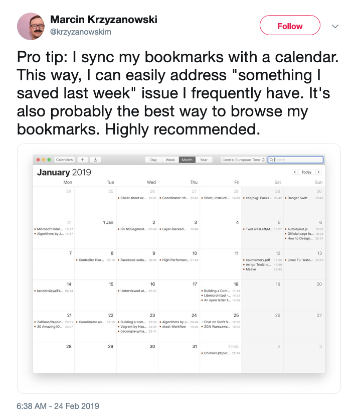
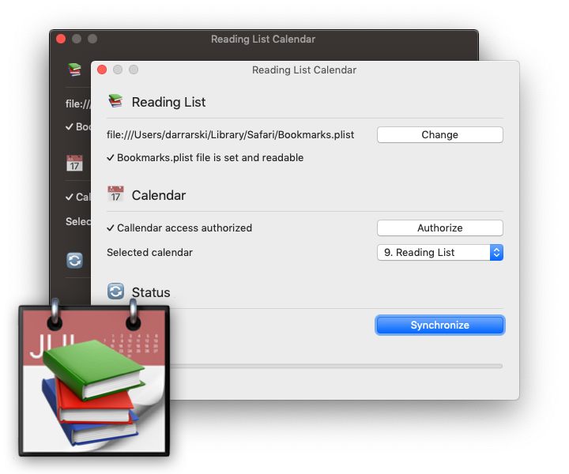

# Reading List Calendar - macOS app

If you are like us, you love to read web articles. No matter if you interested in functional programming or cooking recipes, there is plenty of resources to learn from over the web. If you are an Apple fan, you are probably in common with Safari Reading List - a place for your web articles, stored for later, waiting to be reviewed and read.

A not long time ago, we were inspired by Marcin Krzyżanowski, who show us another non-standard way of storing web bookmarks... in his calendar:

We wanted to explore this way of data visualization, so without waiting another minute, Reading List Calendar app was born. It's a simple macOS app project that synchronizes **Safari Reading List** with your **Calendar**. It's written in Swift, native Cocoa application that does not require any third-party service to work.

We tried to keep it as simple as possible, but also incorporate macOS sandboxing and security features. That way a user has to choose bookmarks location and authorize access to the calendar in the app, otherwise, it won't be able to read and write data considered to be private (your reading list and calendar events).

It was a lot of fun to implement this simple project, basing on an idea from a tweet. The application was build in Xcode, with native Apple frameworks, like AppKit. We used Test Driven Development for most parts of the implementation. 

Tech stack:

- [Swift 5.0](https://swift.org)
- [RxSwift + RxCocoa](https://github.com/ReactiveX/RxSwift)
- [Quick](https://github.com/Quick/Quick) and [Nimble](https://github.com/Quick/Nimble)

We love to share it with you. It's open source and [available on GitHub](https://github.com/elpassion/ReadingListCalendarApp).

## Source

- [Tweet by Marcin Krzyżanowski](https://twitter.com/krzyzanowskim/status/1099679842860257280)
- [Implementation by Dariusz Rybicki](https://github.com/elpassion/ReadingListCalendarApp)

## License

Copyright © 2019 [EL Passion](https://www.elpassion.com)

License: [GNU GPLv3](../../LICENSE)
