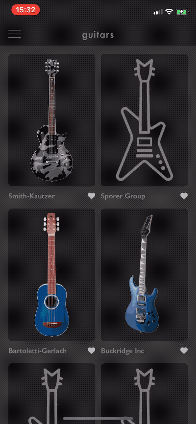

# Paginated list with animated updates (RxFeedback, RxDataSources) 


RxSwift is an amazing framework that streamlines all of the event handling in the iOS apps and making the final products less viable to state related issues. The framework greatly simplifies data updates from different sources such as the local database, HTTP services or websockets. 

At [EL Passion](https://www.elpassion.com) we love using [RxSwift](https://github.com/ReactiveX/RxSwift). In fact we :heart: it so much that we've held the two editions of the [RxSwift workshop for iOS developers](https://edu.elpassion.com/workshops/rxswift/).

However, there are some cases where pure RxSwift is not always enough. For example paginating API results requires parts of explicit state management. That's why [RxFeedback](https://github.com/NoTests/RxFeedback.swift) architecture came to life. It helps modelling system-level interactions with RxSwift abstractions.

In this article we'll show how to build paginated list with animated updates in approximately 100 lines of code using [RxFeedback](https://github.com/NoTests/RxFeedback.swift) architecture and [RxDataSources](https://github.com/RxSwiftCommunity/RxDataSources) for animated updates.

## Case study

The case study comes 100% from a real app built for one of the [EL Passion's](https://www.elpassion.com) Clients. You can see it in action below:

|Case study|
|:-:|
||


### View models

The app's been built using the MVVM architecture. Every collection cell has it's own view model assigned:

```swift
class ModelListItemViewModel: IdentifiableType, Equatable {
    init(model: Model) {
        self.model = model
    }

    // MARK: - Public API

    var image: Driver<UIImage> { /* ... */ }
    var author: Driver<String> { /* ... */ }

    // MARK: - IdentifiableType

    var identity: String {
        return model.id
    }

    // MARK: - Equatable

    public static func == (lhs: ModelListItemViewModel, rhs: ModelListItemViewModel) -> Bool {
        return lhs.model === rhs.model
    } 

    // MARK: - Private

    private let model: Model
}
```

In order to get the nicely animated updates with near-zero development cost, the app uses [RxDataSources](https://github.com/RxSwiftCommunity/RxDataSources) library. That's why the view model conforms to both `IdentifiableType` and `Equatable` types. 

The collection view has a single section modelled as a list of items:

```swift
struct ModelSectionViewModel {
    var items: [ModelListItemViewModel]
}

extension ModelSectionViewModel: AnimatableSectionModelType {
    init(original: ModelSectionViewModel, items: [Item]) {
        self = original
        self.items = items
    }

    var identity: String {
        return String(describing: ModelSectionViewModel.self)
    }
}
```

### RxFeedback

In order to build pagination with [RxFeedback](https://github.com/NoTests/RxFeedback.swift) you need to define:

* state structure,
* possible events enum,
* `reduce` function which converts current state and the event to a new state,
* system description with a list of feedback loops.

### State

The state consists of already downloaded models and next page offset. It also holds a flag to tell whether we should start downloading the next page.

```swift
struct ModelListState: Equatable {
    let models: [Model]
    let nextPageOffset: Int?
    let shouldLoadNextPage: Bool

    init(models: [Model] = [], nextPageOffset: Int? = 0, shouldLoadNextPage: Bool = true) {
        self.models = models
        self.nextPageOffset = nextPageOffset
        self.shouldLoadNextPage = shouldLoadNextPage
    }
}
```

### Possible events

Scrolling the list toggles `scrolledTo(item:)` event. There're also 2 types of events to handle API responses (success & failure).

```swift
enum ModelListEvent {
    case scrolledTo(item: IndexPath)
    case response(page: ModelPage)
    case error
}
```

### Reducer

Reducer handles the events as follows:

* scrolled to item event - it flips `shouldLoadNextPage` flag to true when user scrolled down to the bottom item,
* next page response - appends models, updates next page offset and stops fetching the next page.
* error - stops fetching the next page.

```swift
extension ModelListState {
    static func reduce(state: ModelListState, event: ModelListEvent) -> ModelListState {
        switch event {
        case let .scrolledTo(indexPath):
            return reduceLoadNextPage(item: indexPath.item, state: state)
        case let .response(page):
            return ModelListState(
                models: state.models + page.models,
                nextPageOffset: page.nextPageOffset,
                shouldLoadNextPage: false
            )
        case .error:
            return ModelListState(original: state, shouldLoadNextPage: false)
        }
    }

    var fetchOffset: Int? {
        return shouldLoadNextPage ? nextPageOffset : nil
    }

    // MARK: - Private

    private static func reduceLoadNextPage(item: Int, state: ModelListState) -> ModelListState {
        guard !state.shouldLoadNextPage, item + 1 >= state.models.count else {
            return state
        }

        return ModelListState(original: state, shouldLoadNextPage: true)
    }
}
```

### Feedback loop

There are 2 feedback loops defined:

* UI feedback loop - it wires view models to the collection view and receives scroll to item events,
* react feedback loop - it triggers fetching the next page when `fetchOffset` property is present for the page.

```swift
/// Signal called on will display cell event
let willDisplaySubject: PublishSubject<IndexPath>

/// Observable list of sections that drive UICollectionView
let sectionsRelay: BehaviorRelay<[ModelSectionViewModel]>

/// Creates a view model for a single list item from the API data
let itemViewModel: (Model) -> ModelListItemViewModel

/// Downloads a single page of results from the API
let listProvider: (Int) -> Single<ModelPage>

/// Maps state updates into events stream
let bindings: (Driver<ModelListState>) -> Signal<ModelListEvent> = bind(self) { me, state in
    let sectionSubscription = state
        .map { $0.models.map { me.itemViewModel(for: $0) } }
        .map { [ModelSectionViewModel(items: $0)] }
        .drive(me.sectionsRelay)

    let displayCellEvent = me.willDisplayCellSubject
        .map { ModelListEvent.scrolledTo(item: $0) }
        .asSignal(onErrorJustReturn: .error)

    return Bindings(subscriptions: [sectionSubscription], events: [displayCellEvent])
}

/// Models whole pagination subsystem
Driver.system(
    initialState: ModelListState(),
    reduce: ModelListState.reduce,
    feedback: bindings,
    react(query: { $0.fetchOffset }, effects: { [listProvider] offset in
        listProvider(offset)
            .map { ModelListEvent.response(page: $0) }
            .asSignal(onErrorJustReturn: .error)
        })
    )
.drive()
.disposed(by: disposeBag)
```

## License

Copyright © 2019 [EL Passion](https://www.elpassion.com)

License: [GNU GPLv3](../../LICENSE)