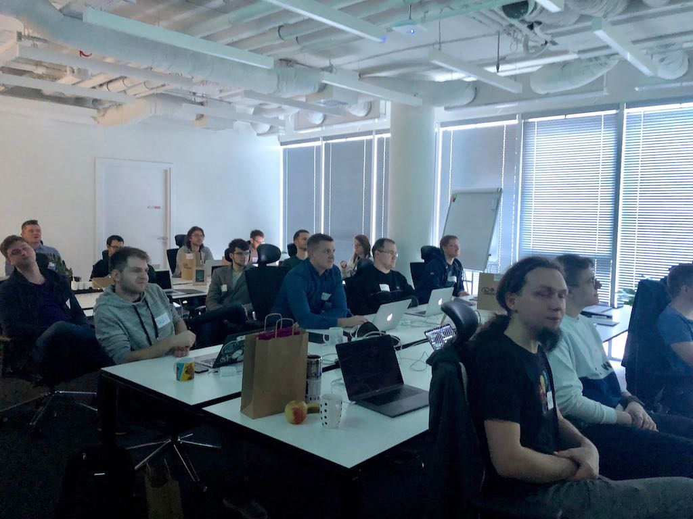
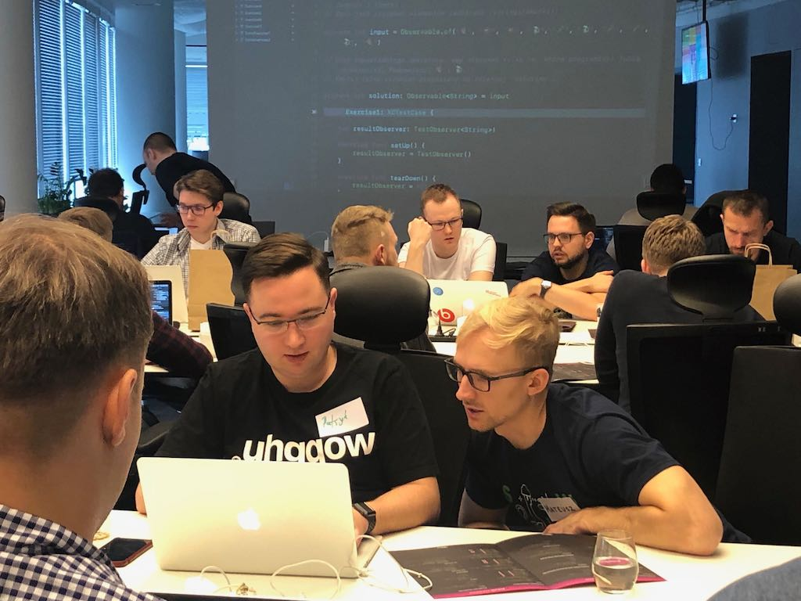
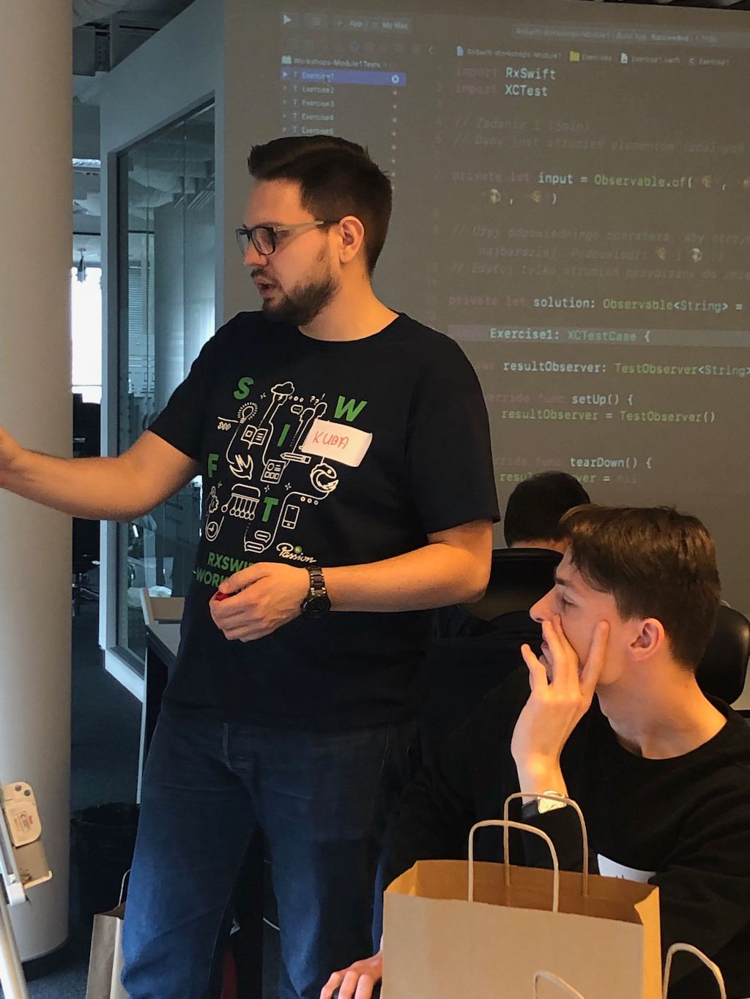
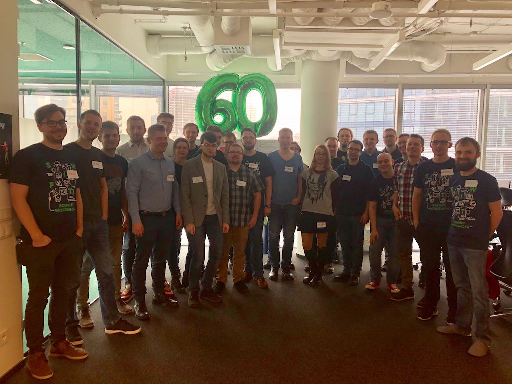

# RxSwift workshops

> Do you want us to run a professional RxSwift training in your company? Contact us at [projects@elpassion.com](mailto:projects@elpassion.com).

The mobile team at **EL Passion** is very enthusiastic about reactive programming. The reactive approach helps us build the apps thinking about the functionalities, not about technical matters of keeping the internal state in sync.

In fact, we use reactive programming so extensively that we'd decided to share the knowledge with others. We've held two editions of RxSwift workshops during which we've mentored almost **40 iOS developers** through their first steps with the framework and reactive programming in general!

## Content

The workshop is aimed towards seasoned iOS developers who have no prior experience with RxSwift. It consists of three modules:

1. Introduction to Functional Reactive Programming and basic RxSwift operators.
2. UI bindings with RxCocoa.
3. Reactive networking.

Each module consists of a theoretical introduction in form of the presentation and a set of the practical exercises focused on implementing the most common tasks in the reactive fashion.

## Agenda

- **9:00 - 9:30** Project setup
- **9:30 - 11:30** FRP and basic RxSwift operators
- **11:30 - 12:00** Coffee break
- **12:00 - 14:00** UI bindings in RxCocoa
- **14:00 - 15:00** Lunch break
- **15:00 - 17:00** Reactive API calls
- **17:00 - 17:15** Experiences & closing thoughts

## Attendees' reviews

Review #1:

> I've visited EL Passion during the RxSwift training. I work in software development for over 15 years, and I have to admit that I've never seen such a well-organized workshop ran free of charge. I was impressed by how professional the whole organization had been.

Review #2: 

> Thanks to iOS team for professional and well prepared RxSwift workshop.

Review #3:

> I took part in RxSwift training ran by EL Passion. Very substantive workshops, great preparation and held in a nice atmosphere.

You can read more reviews on [our Facebook page](https://www.facebook.com/pg/elpassion/reviews/).

## Pictures

|Pictures|
|:-:|
||
||
||
||

Check out more pictures at [our Facebook page](https://www.facebook.com/elpassion/posts/2080492595363174).

## License

Copyright © 2019 [EL Passion](https://www.elpassion.com)

License: [GNU GPLv3](../../LICENSE)
