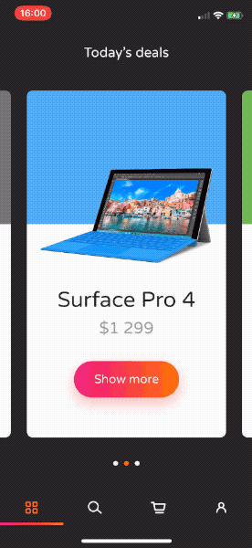

# Snapshot-based transitions in UIKit


Nice transitions greatly improve user experience. Animating frames and auto layout constraints could be tricky. Fortunately, we can animate view snapshots, and `UIKit` provides tools for that out of the box!

## Example

Below you can see real-life example, taken from [E-commerce Today's deals interaction, iOS demo](https://github.com/elpassion/ecommerce-ios-demo).

|Example|
|:-:|
||

## Implementation

To take snapshots and animate the transition we will use `SnapshotTransition` class: 

```swift
/// Snapshot-based keyframe-animated views transition
/// Allows to perform transition form one view to another, optionally animating child views
public final class SnapshotTransition {

    /// Create snapshot transition
    ///
    /// - Parameters:
    ///   - from: source view
    ///   - to: target view
    ///   - container: container view in which transition occurs
    ///   - clipToBounds: set to false if you don't want bounds clipping (default value is true)
    ///   - childTransitions: array of (source childview, target childview) tuples that should be
    ///     animated separately alongside transition (default value is an empty array)
    public init(from: UIView,
                to: UIView,
                in container: UIView,
                clipToBounds: Bool = default,
                childTransitions: [(from: UIView, to: UIView)] = default)

    /// Call when you are ready to perform transition (when your views are layed out etc.)
    public func prepare()

    /// Call inside UIView.animateKeyframes animations closure to add transition animation keyframes
    public func addKeyframes()

    /// Call when transition completes, to clean it up and remove from container view
    public func cleanUp()
}
```

Full source code available in [SnapshotTransition.swift](SnapshotTransition.swift).

## How to use it

In order to implement custom view controllers transition, you will have to follow `UIKit` guides for implementing [UIViewControllerTransitioningDelegate](https://developer.apple.com/documentation/uikit/uiviewcontrollertransitioningdelegate) and [UIViewControllerAnimatedTransitioning](https://developer.apple.com/documentation/uikit/uiviewcontrolleranimatedtransitioning). Then you can create `SnapshotTransition` object and perform animations:

```swift
// MARK: UIViewControllerAnimatedTransitioning

func animateTransition(using transitionContext: UIViewControllerContextTransitioning) {
    let sourceView: UIView = ... // provide a view from presenting view controller
    let targetView: UIView = ... // provide the presented view controller's view

    // preapre transition context, add target view to container if needed
    if targetView.superview == nil {
        transitionContext.containerView.addSubview(targetView)
        targetView.frame = transitionContext.containerView.bounds
    }

    let transition = SnapshotTransition(
        from: sourceView, 
        to: targetView,
        in: transitionContext.containerView,
        childTransitions: [
            // optionally provide child views pairs that should be 
            // animated separately alongside the transition:
            (from: sourceView.subviewA, to: targetView.subviewA),
            (from: sourceView.subviewB, to: targetView.subviewB),
            (from: sourceView.subviewC, to: targetView.subviewC)
        ]
    )

    transition.prepare()

    UIView.animateKeyframes(
        withDuration: transitionDuration(using: transitionContext),
        delay: 0,
        options: [],
        animations: { transition.addKeyframes() },
        completion: { finished in
            transition.cleanUp()
            let completed = finished && !transitionContext.transitionWasCancelled
            transitionContext.completeTransition(completed)
        }
    )
}
```

If you prefer a real-life example, check out [E-commerce Today's deals interaction, iOS demo](https://github.com/elpassion/ecommerce-ios-demo) implementation.

## License

Copyright © 2019 [EL Passion](https://www.elpassion.com)

License: [GNU GPLv3](../LICENSE)
