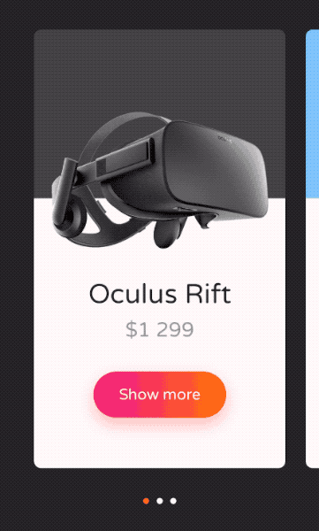

# Custom pagination in UIScrollView


There are various ways of implementing custom pagination in `UIScrollView` (or `UITableView` or `UICollectionView`). Below you can find very simple and effective one. 

## ScrollPageController

```swift
struct ScrollPageController {

    func pageOffset(for offset: CGFloat, velocity: CGFloat, in pageOffsets: [CGFloat]) -> CGFloat? {
        let pages = pageOffsets.enumerated().reduce([Int: CGFloat]()) {
            var dict = $0
            dict[$1.0] = $1.1
            return dict
        }
        guard let page = pages.min(by: { abs($0.1 - offset) < abs($1.1 - offset) }) else {
            return nil
        }
        if abs(velocity) < 0.2 {
            return page.value
        }
        if velocity < 0 {
            return pages[pageOffsets.index(before: page.key)] ?? page.value
        }
        return pages[pageOffsets.index(after: page.key)] ?? page.value
    }

    func pageFraction(for offset: CGFloat, in pageOffsets: [CGFloat]) -> CGFloat? {
        let pages = pageOffsets.sorted().enumerated()
        if let index = pages.first(where: { $0.1 == offset })?.0 {
            return CGFloat(index)
        }
        guard let nextOffset = pages.first(where: { $0.1 >= offset })?.1 else {
            return pages.map { $0.0 }.last.map { CGFloat($0) }
        }
        guard let (prevIdx, prevOffset) = pages.reversed().first(where: { $0.1 <= offset }) else {
            return pages.map { $0.0 }.first.map { CGFloat($0) }
        }
        return CGFloat(prevIdx) + (offset - prevOffset) / (nextOffset - prevOffset)
    }

}

```

If you are looking for a drop-in solution for your project, check out attached [ScrollPageController.swift](ScrollPageController.swift) file and its tests in [ScrollPageControllerSpec.swift](ScrollPageControllerSpec.swift).

## How to use it

It's quite simple:

```swift
class ExampleViewController: UIViewController, UIScrollViewDelegate {
    
    // to make pagination working, implement this delegate function:
    
    func scrollViewWillEndDragging(_ scrollView: UIScrollView, withVelocity velocity: CGPoint, targetContentOffset: UnsafeMutablePointer<CGPoint>) {
        if let pageOffset = ScrollPageController().pageOffset(
            for: scrollView.contentOffset.x, 
            velocity: velocity.x, 
            in: pageOffsets(in: scrollView)
        ) {
            targetContentOffset.pointee.x = pageOffset
        }
    }
    
    // if you have a page control you would like to update when scrolling:
    
    func scrollViewDidScroll(_ scrollView: UIScrollView) {
        if let pageFraction = ScrollPageController().pageFraction(
            for: scrollView.contentOffset.x, 
            in: pageOffsets(in: scrollView)
        ) {
            let pageControl: UIPageControl = // your page controll
            pageControl.currentPage = Int(round(pageFraction))
        }
    }
        
    private func pageOffsets(in scrollView: UIScrollView) -> [CGFloat] {
        // return page offsets, see bellow for an example
    }

}
```

If you want to page by scroll view frame width:

```swift
    private func pageOffsets(in scrollView: UIScrollView) -> [CGFloat] {
        let pageWidth = scrollView.bounds.width
                        - scrollView.adjustedContentInset.left
                        - scrollView.adjustedContentInset.right
        let numberOfPages = Int(ceil(scrollView.contentSize.width / pageWidth))
        return (0..<numberOfPages).map { CGFloat($0) * pageWidth - scrollView.adjustedContentInset.left }
    }
```

If you want to page by scroll view subviews:

```swift
    private func pageOffsets(in scrollView: UIScrollView) -> [CGFloat] {
        return scrollView.subviews
                         .compactMap { $0 as? PageView }
                         .map { $0.frame.minX - scrollView.adjustedContentInset.left }
    }
```

## Example

Below you can see real-life example, taken from [E-commerce Today's deals interaction, iOS demo](https://github.com/elpassion/ecommerce-ios-demo).

|Example|
|:-:|
||

