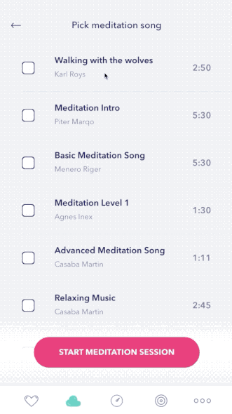
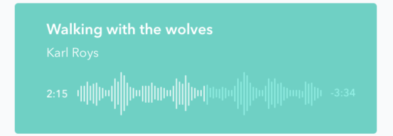
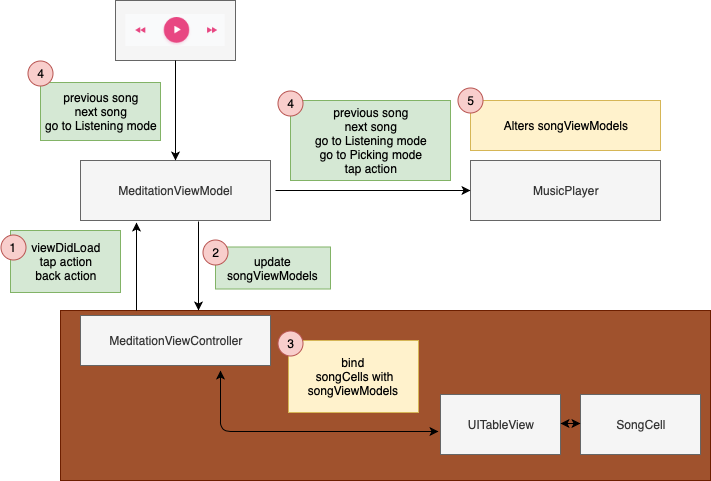

# UITableView vs Managing business logic in MVVM

`MVVM design architecture` is getting increasingly popular in iOS development 
and it is my favourite considering last months ❤️ 

Recently I've completed implementing relaxing dribbble shot of [Ela Kumela](https://dribbble.com/shots/3853204-Meditation-app?utm_source=Clipboard_Shot&utm_campaign=kumela&utm_content=Meditation%20app&utm_medium=Social_Share) 🧘‍♂️

Today, I would like to share with you details on how did I solve `song management functionality in MVVM` world. I hope you will find it useful and find inspiration in your beloved iOS development 🤠

Below you can see iPhone simulator recording from the `music player`

|Player demo|
|:-:|
||


## Model


As you can see there are two screen kinds:

- picking
- listening

and, in total, four different modes of the SongCell:

	
|.picking(.unselected)|.picking(.selected)|.listening(.playable)|.listening(.playing)|
|:-:|:-:|:-:|:-:|
|||||


Combinig them together we will build structure such below:

```swift
enum Picking: Equatable {
    case selected, unselected
}

enum Listening: Equatable {
    case playable, playing, hidden
}

enum SongMode: Equatable {
    case picking(Picking)
    case listening(Listening)
}

```
There is one additional mode of `.listening(.hidden)`. In the listening mode all unselected cells get invisible.

## ViewModel

In MVVM world every subview has its corresponding viewModel. In our case every SongCell has its SongViewModel. Take a look at its interface:

```swift

protocol SongViewModeling: class {
    var title: String { get }
    var subtitle: String { get }
    var time: String { get }
    var songMode: SongMode { get set } // 1
    var songModeHandler: SongModeHandling { get } //2
}

```
There are two interesting properties we should take closer look at:


`1` - we will use that model for cell configuration

`2` - [SongModeHandling](https://github.com/elpassion/meditation-ios-demo/blob/master/MeditationAppShowcase/MeditationAppShowcase/Screens/Meditation/SongPicker/SongModeEmitter.swift) is an observer pattern protocol. When updating the songMode, songModeHandler should emit the current mode. We will  use it for updating visible cell states. Remember to unsubscribe from it when reusing the cell ☝️

## Binding viewModels with cells

The last part that left is binding [songViewModels](https://github.com/elpassion/meditation-ios-demo/blob/master/MeditationAppShowcase/MeditationAppShowcase/Screens/Meditation/SongPicker/SongViewModel.swift) with its corresponding [songCells](https://github.com/elpassion/meditation-ios-demo/blob/master/MeditationAppShowcase/MeditationAppShowcase/Screens/Meditation/SongPicker/SongViewCell.swift). We will implement that logic in [MeditationViewController](https://github.com/elpassion/meditation-ios-demo/blob/master/MeditationAppShowcase/MeditationAppShowcase/Screens/Meditation/MeditationViewController.swift) as it already is a delegate and data source of tableView. Below there is a simplified MVVM architecture flow:

|Simplified MVVM architecture flow|
|:-:|
||

`1` - [MeditationViewController](https://github.com/elpassion/meditation-ios-demo/blob/master/MeditationAppShowcase/MeditationAppShowcase/Screens/Meditation/MeditationViewController.swift) updates its [MeditationViewModel](https://github.com/elpassion/meditation-ios-demo/blob/master/MeditationAppShowcase/MeditationAppShowcase/Screens/Meditation/MeditationViewModel.swift) about view life cycle and UI actions

`2` - [MeditationViewModel](https://github.com/elpassion/meditation-ios-demo/blob/master/MeditationAppShowcase/MeditationAppShowcase/Screens/Meditation/MeditationViewModel.swift) updates [MeditationViewController](https://github.com/elpassion/meditation-ios-demo/blob/master/MeditationAppShowcase/MeditationAppShowcase/Screens/Meditation/MeditationViewController.swift) with [songViewModels](https://github.com/elpassion/meditation-ios-demo/blob/master/MeditationAppShowcase/MeditationAppShowcase/Screens/Meditation/SongPicker/SongViewModel.swift)

`3` - [MeditationViewController](https://github.com/elpassion/meditation-ios-demo/blob/master/MeditationAppShowcase/MeditationAppShowcase/Screens/Meditation/MeditationViewController.swift) binds [songViewModels](https://github.com/elpassion/meditation-ios-demo/blob/master/MeditationAppShowcase/MeditationAppShowcase/Screens/Meditation/SongPicker/SongViewModel.swift) with [songCells](https://github.com/elpassion/meditation-ios-demo/blob/master/MeditationAppShowcase/MeditationAppShowcase/Screens/Meditation/SongPicker/SongViewCell.swift)

```swift
func configure(cell: SongViewCell, with viewModel: SongViewModeling) {
        cell.interactiveView.songView.titleLabel.text = viewModel.title
        cell.interactiveView.songView.subtitleLabel.text = viewModel.subtitle
        cell.interactiveView.songView.timeLabel.text = viewModel.time
        cell.update(mode: viewModel.songMode, animated: false)
        cell.disposable = viewModel.songModeHandler.addHandler(target: cell,
                                                               handler: SongViewCell.update)
    }
```

`4` - [MeditationViewModel](https://github.com/elpassion/meditation-ios-demo/blob/master/MeditationAppShowcase/MeditationAppShowcase/Screens/Meditation/MeditationViewModel.swift) manages business logic. It listeins to [ActionViewModel](https://github.com/elpassion/meditation-ios-demo/blob/master/MeditationAppShowcase/MeditationAppShowcase/Screens/ActionController/ActionViewModel.swift) events and delegates work to [MusicPlayer](https://github.com/elpassion/meditation-ios-demo/blob/master/MeditationAppShowcase/MeditationAppShowcase/Screens/Meditation/MusicPlayer.swift)

`5` - [MusicPlayer](https://github.com/elpassion/meditation-ios-demo/blob/master/MeditationAppShowcase/MeditationAppShowcase/Screens/Meditation/MusicPlayer.swift) contains aggregate methods for altering modes of song ViewModels - stateless entity

## Summary

In MVVM architecture we name both ViewControllers and Views as View and it should not have any business logic but only listens to its ViewModel orders. In our meditation example the View ([MeditationViewController](https://github.com/elpassion/meditation-ios-demo/blob/master/MeditationAppShowcase/MeditationAppShowcase/Screens/Meditation/MeditationViewController.swift)) is completely without business logic. It has only view logic such building subviews and configurating them with child viewModels ([songViewModels](https://github.com/elpassion/meditation-ios-demo/blob/master/MeditationAppShowcase/MeditationAppShowcase/Screens/Meditation/SongPicker/SongViewModel.swift))

This way all the business logic can be extracted to ViewModel ([MeditationViewModel](https://github.com/elpassion/meditation-ios-demo/blob/master/MeditationAppShowcase/MeditationAppShowcase/Screens/Meditation/MeditationViewModel.swift)) and its helpers that make the code readable and divided into single responsibility entities:

- songViewModels manager [MusicPlayer](https://github.com/elpassion/meditation-ios-demo/blob/master/MeditationAppShowcase/MeditationAppShowcase/Screens/Meditation/MusicPlayer.swift)
- screen state operator [MeditationScreenStateOperator](https://github.com/elpassion/meditation-ios-demo/blob/master/MeditationAppShowcase/MeditationAppShowcase/Screens/Meditation/MeditationScreenStateOperator.swift)

For more details see [meditaion-ios-demo](https://github.com/elpassion/meditation-ios-demo) 

Enjoy! ❤️


## License

Copyright © 2019 [EL Passion](https://www.elpassion.com)

License: [GNU GPLv3](../../LICENSE)


