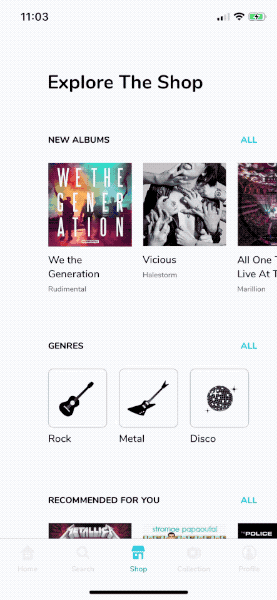

# VinylShop mobile app

Our iOS team at [EL Passion](https://elpassion.com) wanted to know what it takes to put our designers' work into motion. We've challenged ourselves to build demanding shots while retaining our trademark high code quality.

One of the outcomes is the [Vinyl Shop mobile app](https://dribbble.com/shots/4996346-Vinyl-Shop-mobile-app) by [@MatPrzegietka](https://dribbble.com/MatPrzegietka) implementation. 

|Dribbble shot|Implementation|
|:-:|:-:|
|||

- Swift 4.2
- Unit test code coverage: 100%

## Source

- [Dribbble shot by Mateusz Przegiętka](https://dribbble.com/shots/4996346-Vinyl-Shop-mobile-app)
- [iOS implementation by Jakub Turek](https://github.com/elpassion/VinylShop)

## License

Copyright © 2019 [EL Passion](https://www.elpassion.com)

License: [GNU GPLv3](../../LICENSE)
