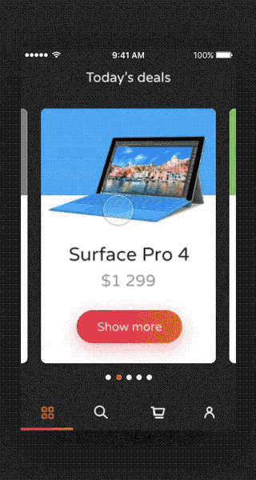
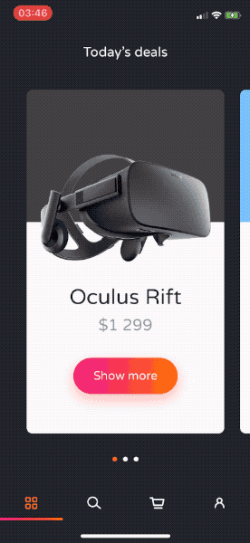

# E-commerce Today's deals interaction, iOS demo

We love implementing challenging designs. Below you can see how we converted a Dribbble shot made by one of our designers 
into native iOS application.

|Dribbble shot|Demo app|
|:-:|:-:|
|||

- Swift 4.2
- Code coverage: 100%

## Source

- [Dribbble shot by Matt Koziorowski](https://dribbble.com/shots/3116611-E-commerce-Today-s-deals-interaction)
- [iOS implementation by Dariusz Rybicki](https://github.com/elpassion/ecommerce-ios-demo)
