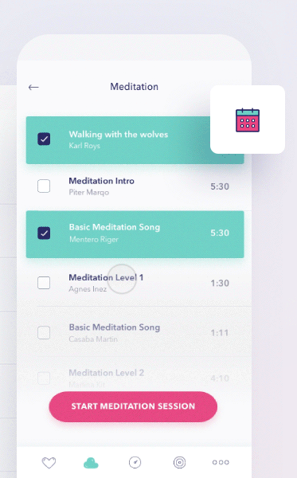
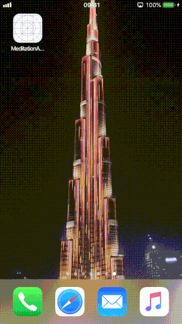

# Meditation app for iOS - dribbble shot implementation

We love implementing beautiful applications. Below you can see how we converted a relaxing Dribbble shot made by one of our designers 
into native iOS application.

|Dribbble shot|Demo app|
|:-:|:-:|
|||

- Swift 4.2
- 100% unit-testable code 🔥

## Source

- [Dribbble shot by Ela Kumela](https://dribbble.com/shots/3853204-Meditation-app)
- [iOS implementation by Bartłomiej Guminiak](https://github.com/elpassion/meditation-ios-demo)

## License

Copyright © 2019 [EL Passion](https://www.elpassion.com)

License: [GNU GPLv3](../../LICENSE)
