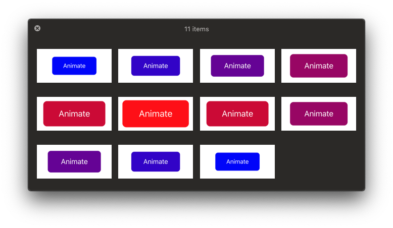

# Testing animations in UIKit


We take tests seriously at [EL Passion](https://www.elpassion.com). When implementing iOS apps, we always try to practice TDD, pair-programming and regular code-reviews. We want our software to be stable and bug-free. We often work on apps with outstanding design, that includes animations. In this case, we incorporate snapshot-based tests that work not only for static UI but also for animations.

## Example

Below you can see a real-life example, taken from [E-commerce Today's deals interaction, iOS demo](https://github.com/elpassion/ecommerce-ios-demo). We implemented custom animation for view controllers transition and tested it using snapshot tests.

|Application|Test snapshots|
|:-:|:-:|
|||

## Animation

Take a look at a simplified example. Consider we have an animated button:


It's implemented using native `UIKit` keyframes animation API:

```swift
func animate() {
    UIView.animateKeyframes(
        withDuration: 2,
        delay: 0,
        options: [],
        animations: {
            UIView.addKeyframe(
                withRelativeStartTime: 0,
                relativeDuration: 0.5,
                animations: {
                    self.button.transform = CGAffineTransform(scaleX: 1.5, y: 1.5)
                    self.button.backgroundColor = .red
                }
            )
            UIView.addKeyframe(
                withRelativeStartTime: 0.5,
                relativeDuration: 0.5,
                animations: {
                    self.button.transform = .identity
                    self.button.backgroundColor = .blue
                }
            )
        }
    )
}
```

You can find full source code in [ExampleViewController.swift](ExampleViewController.swift) file.

## Tests

To test our animated button, we will use [SnapshotTesting](https://github.com/pointfreeco/swift-snapshot-testing) library from [Point-Free](https://www.pointfree.co).

In our `XCTestCase` we have to add the animated view to a window:

```swift
override func setUp() {
    sut = ExampleViewController()
    window = UIWindow(frame: CGRect(x: 0, y: 0, width: 220, height: 100))
    window.rootViewController = sut
    window.isHidden = false
}
```

We can then control animation progress using [UIViewPropertyAnimator](https://developer.apple.com/documentation/uikit/uiviewpropertyanimator). After setting the desired progress of the animation, we can make a snapshot of the containing window:


```swift
func testAnimation() {
    let animator = UIViewPropertyAnimator(duration: 1, curve: .linear, animations: {
        self.sut.animate()
    })

    (0...10).map { CGFloat($0) / 10.0 }.forEach { animationProgress in
        animator.fractionComplete = animationProgress
        assertSnapshot(
            matching: window,
            as: .image(drawHierarchyInKeyWindow: true),
            named: "animation_\(String(format: "%02.0f", animationProgress * 10))"
        )
    }

    animator.pauseAnimation()
    animator.stopAnimation(false)
    animator.finishAnimation(at: .current)
}
```

This will result in generating 11 snapshot images that our animation will be compared to, every time we run tests:



You can find full source code of presented `XCTestCase` subclass in [ExampleViewControllerTests.swift](ExampleViewControllerTests.swift) file.

## License

Copyright © 2019 [EL Passion](https://www.elpassion.com)

License: [GNU GPLv3](../../LICENSE)
